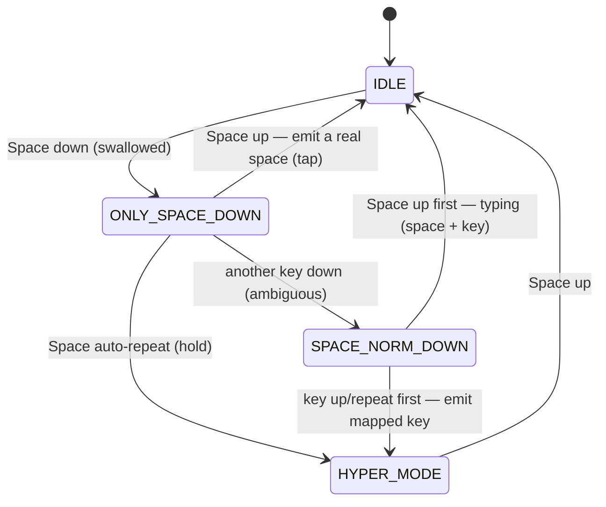

# Space++ for Windows

[](https://github.com/zzqq2199/SuperSpaceWin/actions/workflows/release.yml)
[](https://github.com/zzqq2199/SuperSpaceWin/releases)
[](LICENSE)


**Keep your hands on the home row. Turn the space bar into a Hyper key.**

Space++ lets you hold <kbd>Space</kbd> and use the keys already under your
fingers for arrows, page navigation, word/line deletion, copy/paste, and
function keys — no reaching for the arrow cluster, <kbd>Home</kbd>/<kbd>End</kbd>,
or the <kbd>F</kbd> row. Tap <kbd>Space</kbd> and it's still just a space.

English | [中文](README_CN.md)

---

## Why?

The arrow keys, <kbd>Home</kbd>/<kbd>End</kbd>, <kbd>Page Up/Down</kbd>, and
<kbd>Delete</kbd> are all far from the home row. Every trip there breaks your
flow and slows you down.

Space++ solves this by overloading the one key your thumbs already rest on:

- **No home-row exits** — move the caret, jump lines, page through documents,
  and delete by word or line without moving your hands.
- **Zero learning curve for typing** — a normal space is unchanged; the Hyper
  layer only activates while <kbd>Space</kbd> is held.
- **Single file, no install** — one ~340 KB exe with the default config baked
  in. Download and run.
- **Faithful to the macOS original** — the exact same tap/hold disambiguation
  state machine as [SuperSpace](https://github.com/zzqq2199/SuperSpace),
  reimplemented natively in Rust.

## Quick start

1. Download `SpacePP-<version>-windows-x86_64.zip` from the
   [Releases](https://github.com/zzqq2199/SuperSpaceWin/releases) page.
2. Unzip and run `spacepp-win.exe`.
3. A tray icon appears (gray = idle, orange = Hyper active). That's it — start
   holding <kbd>Space</kbd>.

Right-click the tray icon for **Start with Windows** and **Exit**. To quit from
the keyboard, press <kbd>Space</kbd>+<kbd>Q</kbd>.

> Prefer to build it yourself? See [docs/BUILDING.md](docs/BUILDING.md).

## Shortcuts

All shortcuts are "hold <kbd>Space</kbd>, then press the key". Fully
customizable in `config.json`.

| Keys | Action | Equivalent |
| --- | --- | --- |
| <kbd>Space</kbd>+<kbd>H</kbd>/<kbd>J</kbd>/<kbd>K</kbd>/<kbd>L</kbd> | Move caret | ← ↓ ↑ → |
| <kbd>Space</kbd>+<kbd>Y</kbd> / <kbd>O</kbd> | Line start / end | Home / End |
| <kbd>Space</kbd>+<kbd>U</kbd> / <kbd>I</kbd> | Page down / up | Page Down / Page Up |
| <kbd>Space</kbd>+<kbd>E</kbd> | Escape | Esc |
| <kbd>Space</kbd>+<kbd>M</kbd> | Delete previous char | Backspace |
| <kbd>Space</kbd>+<kbd>N</kbd> | Delete previous word | Ctrl+Backspace |
| <kbd>Space</kbd>+<kbd>B</kbd> | Delete to line start | Shift+Home, Backspace |
| <kbd>Space</kbd>+<kbd>,</kbd> | Delete next char | Delete |
| <kbd>Space</kbd>+<kbd>.</kbd> | Delete next word | Ctrl+Delete |
| <kbd>Space</kbd>+<kbd>/</kbd> | Delete to line end | Shift+End, Delete |
| <kbd>Space</kbd>+<kbd>C</kbd> / <kbd>V</kbd> | Copy / paste | Ctrl+C / Ctrl+V |
| <kbd>Space</kbd>+<kbd>1</kbd>…<kbd>0</kbd> <kbd>-</kbd> <kbd>=</kbd> | Function keys | F1…F12 |
| <kbd>Space</kbd>+<kbd>Q</kbd> | Quit Space++ | — |

Holding <kbd>Space</kbd> by itself enters Hyper mode (`hold_as_hyper: true`); a
quick tap still types a space.

## How it works

The hard part is telling "typing a space" apart from "using Space as a
modifier", without adding lag. Space++ defers the decision through a small
state machine (identical to the macOS version):



Under the hood: a `WH_KEYBOARD_LL` low-level keyboard hook intercepts input, and
synthetic keys are injected with `SendInput` tagged via `dwExtraInfo` so the
hook ignores its own output. A physically held modifier (Shift, Ctrl, Win…)
combines with injected keys at the OS level, so e.g. <kbd>Shift</kbd>+<kbd>Space</kbd>+<kbd>H</kbd>
selects text.

## Configuration

Space++ runs on the embedded default config. To customize, place a `config.json`
next to the exe (or point `SPACEPP_CONFIG` at one). It uses the same JSON shape
and key names as the macOS version — `command` is translated to Ctrl, `option`
to Alt, and `delete` means Backspace. A mapping value may also be an **array**
to express a key sequence:

```json
"b": [{"key": "home", "modifiers": ["shift"]}, {"key": "delete"}]
```

### Blacklist — pass through for specific apps

When the foreground window belongs to a listed process, Space++ gets out of the
way entirely (a space is just a space). Handy for games that need raw keys.
Process names are case-insensitive:

```json
"blacklist": ["GameApp.exe", "AnotherGame.exe"]
```

The check is cached per foreground window, so it only queries process info when
you switch windows — no added latency while typing.

### Win+L lock protection

Moving windows with <kbd>Space</kbd>+<kbd>Win</kbd>+<kbd>H</kbd>/<kbd>J</kbd>/<kbd>K</kbd>/<kbd>L</kbd>
is a natural gesture, but <kbd>Win</kbd>+<kbd>L</kbd> would normally lock your
PC. `Win+L` is matched by winlogon on raw input, *before* a keyboard hook can
suppress it — so it can't be blocked from user space (PowerToys can't remap it
either). Space++ handles this with a policy guard instead:

- While running, it sets `DisableLockWorkstation` for the current user, so the
  OS ignores <kbd>Win</kbd>+<kbd>L</kbd> and `Space+Win+L` safely moves the
  window.
- An **intentional** bare <kbd>Win</kbd>+<kbd>L</kbd> is still detected and
  locks via `LockWorkStation()`; the guard is re-armed after you unlock.
- On clean exit, the registry value is removed and native behavior is restored.

> If Space++ is force-killed instead of exiting cleanly, the policy value can
> linger and <kbd>Win</kbd>+<kbd>L</kbd> stays disabled. Run Space++ once more
> and exit it normally to restore. While the guard is active, the "Lock" entry
> in the Start menu is also hidden by this Windows policy.

## Configuration reference

| Field | Type | Meaning |
| --- | --- | --- |
| `hyper_keys_map` | object | Source key → target chord (or array of chords) |
| `hold_as_hyper` | bool | Holding Space alone enters Hyper mode |
| `blacklist` | string[] | Foreground process names where Space++ is disabled |
| `verbose.on_state` / `on_event` / `on_action` | bool | Debug logging to `%TEMP%\spacepp.log` |

## Building

See [docs/BUILDING.md](docs/BUILDING.md) for build, test, publish, and release
instructions.

## License

[MIT](LICENSE) © 2026 Quan Zhou
