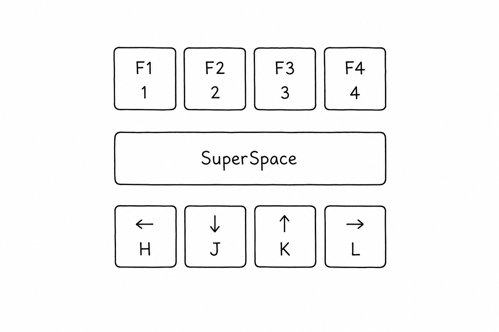
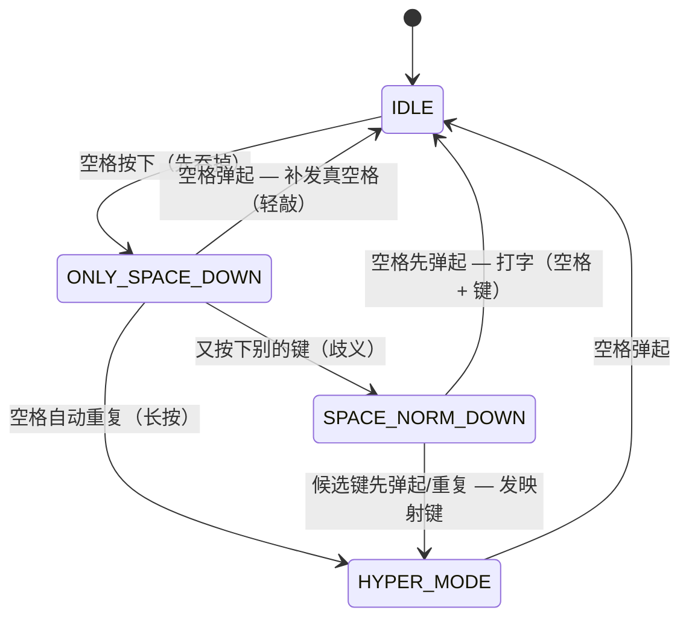

# Space++ for Windows

<p align="center">
  
</p>

<p align="center">
  <a href="https://github.com/zzqq2199/SuperSpaceWin/actions/workflows/release.yml"></a>
  <a href="https://github.com/zzqq2199/SuperSpaceWin/releases"></a>
  <a href="LICENSE"></a>
  
</p>

**双手不离主键盘区，把空格键变成 Hyper 键。**

按住 <kbd>Space</kbd>，用手指下方现成的字母键完成方向移动、翻页、按词/按行删除、复制粘贴、功能键——不用再去够方向键、<kbd>Home</kbd>/<kbd>End</kbd> 或 <kbd>F</kbd> 键区。轻敲 <kbd>Space</kbd>，它依然只是个空格。

[English](README.md) | 中文

---

## 解决什么痛点？

方向键、<kbd>Home</kbd>/<kbd>End</kbd>、<kbd>Page Up/Down</kbd>、<kbd>Delete</kbd> 都远离主键盘区，每次伸手都会打断手感、拖慢速度。

Space++ 把这些操作叠加到大拇指本来就搁着的那一个键上：

- **不用离开主键盘区**——移动光标、跳行、翻页、按词/按行删除，双手保持不动。
- **对打字零影响**——普通空格照旧，只有在按住 <kbd>Space</kbd> 时才激活 Hyper 层。
- **单文件、免安装**——一个约 340 KB 的 exe，默认配置已内嵌，下载即用。
- **忠实移植 macOS 版**——与 [SuperSpace](https://github.com/zzqq2199/SuperSpace) 完全一致的"轻敲/长按"消歧状态机，用 Rust 原生重写。

## 快速开始

1. 从 [Releases](https://github.com/zzqq2199/SuperSpaceWin/releases) 页下载 `SpacePP-<版本>-windows-x86_64.zip`。
2. 解压，运行 `spacepp-win.exe`。
3. 托盘出现图标（灰色=空闲，橙色=Hyper 激活）。开始按住 <kbd>Space</kbd> 即可。

右键托盘图标可开关 **开机自启** 和 **退出**。用键盘退出：<kbd>Space</kbd>+<kbd>Q</kbd>。

> 想自己编译？见 [docs/BUILDING.md](docs/BUILDING.md)。

## 快捷键

用法均为"按住 <kbd>Space</kbd> 再按对应键"，可在 `config.json` 中自定义。

| 组合 | 功能 | 等价于 |
| --- | --- | --- |
| <kbd>Space</kbd>+<kbd>H</kbd>/<kbd>J</kbd>/<kbd>K</kbd>/<kbd>L</kbd> | 移动光标 | ← ↓ ↑ → |
| <kbd>Space</kbd>+<kbd>Y</kbd> / <kbd>O</kbd> | 行首 / 行尾 | Home / End |
| <kbd>Space</kbd>+<kbd>U</kbd> / <kbd>I</kbd> | 向下 / 向上翻页 | Page Down / Page Up |
| <kbd>Space</kbd>+<kbd>E</kbd> | 取消 | Esc |
| <kbd>Space</kbd>+<kbd>M</kbd> | 删除前一个字符 | Backspace |
| <kbd>Space</kbd>+<kbd>N</kbd> | 删除前一个词 | Ctrl+Backspace |
| <kbd>Space</kbd>+<kbd>B</kbd> | 删除到行首 | Shift+Home, Backspace |
| <kbd>Space</kbd>+<kbd>,</kbd> | 删除后一个字符 | Delete |
| <kbd>Space</kbd>+<kbd>.</kbd> | 删除后一个词 | Ctrl+Delete |
| <kbd>Space</kbd>+<kbd>/</kbd> | 删除到行尾 | Shift+End, Delete |
| <kbd>Space</kbd>+<kbd>C</kbd> / <kbd>V</kbd> | 复制 / 粘贴 | Ctrl+C / Ctrl+V |
| <kbd>Space</kbd>+<kbd>1</kbd>…<kbd>0</kbd> <kbd>-</kbd> <kbd>=</kbd> | 功能键 | F1…F12 |
| <kbd>Space</kbd>+<kbd>Q</kbd> | 退出 Space++ | — |

单独长按 <kbd>Space</kbd> 会进入 Hyper 模式（`hold_as_hyper: true`）；快速轻敲仍然输出空格。

## 工作原理

难点在于既要分辨"打空格"和"把空格当修饰键用"，又不能带来延迟。Space++ 通过一个小状态机延迟决策（与 macOS 版完全一致）：



底层实现：`WH_KEYBOARD_LL` 低级键盘钩子拦截输入，合成按键用 `SendInput` 注入并带 `dwExtraInfo` 标记，使钩子忽略自己的输出。物理按住的修饰键（Shift/Ctrl/Win…）会在 OS 层与注入键组合，所以 <kbd>Shift</kbd>+<kbd>Space</kbd>+<kbd>H</kbd> 可以选中文本。

## 配置

Space++ 默认使用内嵌配置。要自定义，把 `config.json` 放在 exe 同目录（或用环境变量 `SPACEPP_CONFIG` 指定）。JSON 结构和键名与 macOS 版一致——`command` 翻译为 Ctrl，`option` 为 Alt，`delete` 表示 Backspace。映射值也可以是**数组**，表示按键序列：

```json
"b": [{"key": "home", "modifiers": ["shift"]}, {"key": "delete"}]
```

### 黑名单——对特定程序透传

当前台窗口属于列表中的进程时，Space++ 完全让路（空格就是空格），适合需要原始按键的游戏。进程名不区分大小写：

```json
"blacklist": ["GameApp.exe", "AnotherGame.exe"]
```

检测结果按前台窗口缓存，只在切换窗口时才查询进程信息，打字时零额外延迟。

### Win+L 锁屏防护

用 <kbd>Space</kbd>+<kbd>Win</kbd>+<kbd>H</kbd>/<kbd>J</kbd>/<kbd>K</kbd>/<kbd>L</kbd> 移动窗口很顺手，但 <kbd>Win</kbd>+<kbd>L</kbd> 会锁屏。`Win+L` 由 winlogon 在低级钩子拦截**之前**基于原始输入匹配，用户态程序无法阻止（PowerToys 同样无法重映射）。Space++ 改用策略防护：

- 运行期间为当前用户设置 `DisableLockWorkstation`，系统级 <kbd>Win</kbd>+<kbd>L</kbd> 失效，`Space+Win+L` 安全地移动窗口。
- **主动锁屏仍保留**：检测到裸 <kbd>Win</kbd>+<kbd>L</kbd> 时通过 `LockWorkStation()` 代理锁屏，解锁后自动恢复策略。
- 正常退出时删除该注册表值，系统行为完全还原。

> 若 Space++ 被强杀（未正常退出），该策略值可能残留、<kbd>Win</kbd>+<kbd>L</kbd> 保持禁用。重新运行一次并正常退出即可恢复。策略生效期间，开始菜单里的"锁定"入口也会被该 Windows 策略隐藏。

## 配置项参考

| 字段 | 类型 | 含义 |
| --- | --- | --- |
| `hyper_keys_map` | object | 源键 → 目标组合（或组合数组） |
| `hold_as_hyper` | bool | 单独长按空格进入 Hyper 模式 |
| `blacklist` | string[] | 禁用 Space++ 的前台进程名 |
| `verbose.on_state` / `on_event` / `on_action` | bool | 调试日志，写入 `%TEMP%\spacepp.log` |

## 构建

构建、测试、发布说明见 [docs/BUILDING.md](docs/BUILDING.md)。

## 许可证

[MIT](LICENSE) © 2026 Quan Zhou
